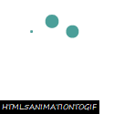
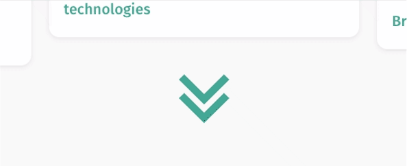

[](https://www.npmjs.com/package/infinite-scroll-init)


# Infinite Scroll Init
Initiate infinite scrolling container that consumes content from an API with option for a cool loading indicator 😎.
The package exposes the `InfiniteScroll` class by default, which is used to initiate the infinite scroll object with the desired configurations. It also expose `initLoadingIndicator` function, such that it is used to initiate loading indicator on given container for pages that doesn't require infinite scroll.

## Installation

```
npm i --save infinite-scroll-init
```
or
```
yarn add infinite-scroll-init
```


Then.. 

```js
import InfiniteScroll from 'infinite-scroll-init';

// Initialize InfiniteScroll obj
const infiniteScroll = new InfiniteScroll({
    container: '#cards.container',
    autoScroll: true,
    dataRoute: '/cards/data',
    dataType: 'html',
    onSuccess: appendCards,
    loadingIndicator: {
        active: true,
        color: '#3B9E98',
    },
    loadMoreIndicator: {
        active: true,
        color: '#3B9E98',
    }
});

/**
 * Handle the result retrieved from fetch request corresponds to each segment
 */ 
function appendCards(res) { 
    ...
 }
```
## Constructor Configuration v5
### Required
The essential configuration that need to be passed to the constructor in order to have a functional infinite scroll, assuming the requested data in `json` format and no need to preserve the infinite scroll state after page reload.
| Config        | Type      | Description                                                                                                 |
| ------------- | :-------: | ----------------------------------------------------------------------------------------------------------- |
| container     | `string`  | The selector string of the container, eg. `'#containerId > .items'`.                                        |
| dataRoute     | `string`  | The url-route to be used in the fetch request.                                                              |
| onSuccess     | `function`| Callback function to handle the response result when the fetch is succeed. The 1st arg is the retrieved result.   |

### Optional
| Config              | Type       | Default       | Description                                                       |
| ------------------- | :--------: |  :----------: | ----------------------------------------------------------------- |
| segment             | `number`   |       -       | The segment number on initiate. Default is the value of segment param in window query-string or `1` if this param doesn't exist. |
| segmentParam        | `string`   | `'segment'`   | The name (key) of the segment parameter. |
| lockInfiniteScroll  | `boolean`  |   `false`     | Lock infinite scroll, so scrolling down won't trigger the fetch function. This is used internally to lock infinite scroll when an empty segment is received (ie. the last segment). <br/> <br/>_Note: To turn off fetch on scrolling consider `scrollLsn` option instead (see detail of this option bellow), or `removeScrollLsn()` function_ |
| autoFill            | `boolean`  |   `true`      | To keep fetching data until the page is filled, ie. scrollbar appears. |
| fetchOnInitiate     | `boolean`  |   `false`     | Trigger a fetch call directly on initiate with `initial=1` param send in the initial request, so the API endpoint differentiate the initial fetch from normal segment fetch. |
| scrollLsn           | `boolean`  |   `true`      | Weather to append a scroll listener at the initiate. <br/><br/> _Note: `addScrollLsn()` and `removeScrollLsn()` can be used to attach/remove listener at later point of script execution._ |
| offset              |  `number`  |`1/2*clientHeight`| The number of pixels till the end of content list that triggers `fetch()` function. In other words, greater number means fetching more content ahead. |
| dataType            |`'html'`\|`'json'`|   `json`      | The type of retrieved data from fetch request. |
| getDataParams       | `function` |   window's query-string | Function return the data (query string or js object) to be used in the fetch request. The default is the current window's query-string: </br> `() => window.location.search.substr(1)`|
| onError             | `function` |   -  | Callback function when the fetch request failed.  |
| noResultsSelector   | `string`   |   -  | Selector string of HTML element to show if there are no results at all (ie. no results in the first segment or `fetchOnInitiate`). It will be hidden when calling `reset()` or `fetch()` function, hence it is hidden when `loadingIndicator` is shown. |
| noResultsMessage    | `string`   |   -  | HTML string for message when there is no results at all (ie. no results in the first segment or `fetchOnInitiate`). Instead of using this option, the HTML string can be set as `data-no-results-message` attribute to the container. |
| onNoResults         | `function` |   -  | Callback function fire if there is no results at all (ie. no results in the first segment or `fetchOnInitiate`). By default it will append the `config.noResultsMessage` option to container, if defined.  |
| updateContentCounter| `function` |   -  | Callback function to update a content counter according to the `Content-Counter` header in the response. Technically, this function is called whenever the `Content-Counter` header exists, passing the value of this header as the first argument. |
| updateParam         | `(key, value) => {}` |   modify window's query-string  | Callback function to update the segment param state externally (ie. on local query-string or session storage). The 1st arg should be the parameter key, and the 2nd arg is the value, `updateParam(segmentParam, segment)`. Default is updating segment param on current window's query-string. |
| loadingIndicator    | `object`   |   inactive    | Please check the configuration of the loading indicator bellow.. |
| loadMoreIndicator   | `object`   |   inactive    | Please check the configuration of the load-more indicator bellow.. |

### Loading indicator
The configuration in the table is set under loadingIndicator object, or need to pass as config object to `initLoadingIndicator` function for separate use.
| Config              | Type       | Default     | Description                                                              |
| ------------------- | :--------: |  :--------: | ------------------------------------------------------------------------ |
| active              | `boolean`  |   `false`   | If set to true, a loading indicator will show up during fetch request.   |
| container           | `string`   |   parent element of infinite-scroll container  | The selector string of the container. |
| color               | `string`   |`'lightgray'`| Color name or hash. |
| size                | `string`   |   `'0.7em'` | The size of the loading indicator. |
| type                | `number`   |   1         | <li> 0 => custom indicator, check `html` option bellow </li> <li> 1 => circle spinning dots</li> <li>2 => horizontal animated dots</li> |
| html                | `string`   |   `''` | The HTML of a custom loading indicator (the class of the outer `<div>` need to be `inf-loading-indicator`). To use this custom indicator the type should be set to 0 |

| Type 1              | Type 2     |
| ------------------- | :--------: |
| [](./Screenshots/loading-indicator-1.gif) | [](./Screenshots/loading-indicator-2.gif) |

### Load-more indicator
The configuration in the table is set under loadMoreIndicator object, or need to pass as config object to `initLoadMoreIndicator` function for separate use. The purpose of this indicator is when a filter is applied with container get emptied, the fetched content might not fill the page (ie. no scroll event can happen), so this will be indicator that more content can be fetched and `onHover` function will explicitly trigger `fetch` to render the next segment without the need for a scroll event.
| Config              | Type       | Default     | Description                                                              |
| ------------------- | :--------: |  :--------: | ------------------------------------------------------------------------ |
| active              | `boolean`  |   `false`   | If set to true, a load-more indicator will show up under last segment.   |
| container           | `string`   |   parent element of infinite-scroll container  | The selector string of the container. |
| color               | `string`   |`'lightgray'`| Color name or hash. |
| scale               | `number`   |   `5`       | The scale of the indicator icon |
| animated            | `boolean`  |   `true`    | Weather to animate the load-more indicator (fadeIn, fadeOut, floating-animation). |
| onHover             | `function` |   `() => this.fetch()`   |  function that fire on mouseover load-more indicator |
| html                | `string`   |   `''`      | The HTML of a custom loading indicator (the class of the outer `<div>` need to be `inf-load-more-indicator`). If this is left empty, the default load-more icon will be used. |

| Default             |
| ------------------- |
| [](./Screenshots/load-more.gif) |


### Expected Response Headers
#### No-Content (Optional)
This is used to explicitly indicate the last segment, hence the `infinityScroll` instance is locked accordingly. If the `No-Content` header isn't featured in the API end-point, the last segment is known by a response with empty payload.

#### Content-Counter (Optional)
This is used to update a counter for total number of items in front-end. Normally this is sent only with the response of the initial segment request, ie. a request with the header `initial` is set to `true`/`1`. The value of this header is passed as first argument to `updateContentCounter()` callback function that has been passed as constructor config.

## API v4/v5
### InfiniteScroll
By default, the package exposes the `InfiniteScroll` class. Here you can find the functions/methods that can be used on the initialized instance of this class.
```js
import InfiniteScroll from 'infinite-scroll-init';

let config = {
    container: '#cards.container',
    dataRoute: '/cards/data',
    onSuccess: appendCards,
    loadingIndicator: {
        active: true,
        type: 2,
        color: '#3B9E98',
    },
    loadMoreIndicator: {
        active: true,
        color: '#3B9E98',
    }
};

// Initialize InfiniteScroll obj
const infiniteScroll = new InfiniteScroll(config);

// change configurations dynamically
config.loadingIndicator.type = 1;
config.updateParam = (key, value) => sessionStorage.setItem(key, value);
infiniteScroll.editConfig(config);

/**
 * Empty the items container, reset segment to 1, and unlock infinite scroll.
 * Make loading indicator visible.
 * Normally, this is used when a filter is applied.
 */
infiniteScroll.reset();

/**
 * Reset segment to 1, and unlock infinite scroll.
 * Pass 'false' to not empty the items container.
 */
infiniteScroll.reset(false);

/**
 * Fetch the next segment of data.
 */
infiniteScroll.fetch();

// The fetch function return a promise that resolve
// to true, if the is more data to fetch.
// Otherwise it resolve to false.
infiniteScroll.fetch()
              .then((moreContent) => {
                if (moreContent)
                  //do something
                else
                  //do something else
               });
              .catch((error) => { ... });

/**
 * Make consecutive fetches until the page is filled, ie. the scrollbar appear.
 */
infiniteScroll.autoFill();

/**
 * lock the infinite scroll.
 */
infiniteScroll.setLockInfiniteScroll(true)

/**
 * Change segment number
 */
infiniteScroll.setSegment(2)

/**
 * Explicitly add/remove scroll listener that trigger the fetch call.
 * Normally, you don't need to call these functions, as they are utilized internally.
 */
infiniteScroll.addScrollLsn()
infiniteScroll.removeScrollLsn();

/**
 * Scroll down to the last three element in the container.
 * If the autoScroll option is set to true, this will be called internally on initiate.
 */
infiniteScroll.scrollDown();
```

### initLoadingIndicator
In case you need to use the loading indicator without initializing an infinite scroll. The package exposes the function for initializing it separately. The initialized indicator has the class `inf-loading-indicator`, so it can be hidden/shown by changing the css `display: none | block` externally. The loading configuration are the same. Please find all configuration in previous section.
```js
import { initLoadingIndicator } from 'infinite-scroll-init';

// Initialize loading indicator
initLoadingIndicator({
    container: '#containerId',
    color: '#3B9E98',
    type: 2
});

// Hide the loading indicator
$('inf-loading-indicator').css("display", "none");
```

## Changes history

#### TO DO
 - Cache content in session storage, so after page reload data would still be available. This might pose an issue with synicing the data in case this page refresh is not accidentally to get the refreshed content list. To tackle it, an refresh indicator can be used to explisitly get the data from the API, not from cache.
 - When caching is done, a `document.documentElement.scrollTop` can be used to auto scroll to the exact point the page was before refresh.
 - `Jump to the top` indicator/button can be added in the corener as an option.

#### v5.2.1
 - Bugfix for showing `noResultsMessage` when it shouldn't
 - Bugfix for initialisation error when container does not exist

#### v5.2
 - Add `noResultsSelector` to hide/show when there is no results at all (the first segment has no results).
 - Always show (append) `noResultsMessage` option in container, even if `onNoResults` is defined.
 - Instead of using `noResultsMessage` option, the HTML string can be set as `data-no-results-message` attribute to the container.
 - Internal enhancement for `cacheNextSegment` function

#### v5.1
 - Add `onNoResults` callback function to fire if there is no results to show.
 - Add `noResultsMessage` to show when there is no results at all (the first segment has no results or `fetchOnInitiate`).

#### v5.0
 - Add `updateContentCounter` callback function to update a content counter according to the `Content-Counter` header in the response.
 - Use generic solution for indicating the last segment:
      - Check `No-Content` header to explicitly indicate the last segment, hence the infinityScroll is locked accordingly. This is used when the payload of the last segment isn't empty, and has some contents like a `<script>` tag or a break line. If the `No-Content` header isn't featured in the API end-point, the last segment is known by a response with empty payload.
      - remove `lastWithScript` config option.

#### v4.3
- Add `lastWithScript` config option to indicate weather the last segment has a `<script>` tag and not empty. This helps to recognize the last segment. [Deprecated in v5.0]

#### v4.2
 - Add `scrollLsn` config option to skip adding scroll listener if set to `false`, and rely solely on hover-callback of load-more indicator to fetch/render the next segment.
#### v4.1
 - Default value of `config.segment` is retrieved automatically from window's query-string using `config.segmentParam` as key. So in ideal case where `segmentParam` is handled through window query-string, the default case of `config.segment` should be sufficient.
#### v4.0
 - Remove jQuery, drop out IE support
 - Fetch and cache the next segment ahead, such that it is always available in session storage to be rendered on scroll event, resulting in better user experience.
 - No need for using `NoMoreContent` header in the response, as the new mechanism always perform fetch-ahead in order to cache upcoming segment content, hence using this data to check if there is indeed more content.
 - Add `offset` option to config, such that the content is rendered ahead by this offset, instead of waiting to reach the end of the content list to trigger `fetch()`.
 - Add loadMoreIndicator to show that there is more content to be fetched. In case where scroll event can't happen because the fetched content didn't fill the page or any other reason, this indicator will explicitly trigger `fetch()` for next segment on hover/mouseover.
 - `initLoadMoreIndicator` as exposed function for separate use.
 - Make build-in `updateParam()` and `getDataParams()` functions to use as default. These will work on window's query-string to update segment param and retrieve the data params for `fetch()`. Nevertheless, these two function can be override as usual through constructor config.

#### v3.2
 - `initLoadingIndicator()` function accepts selector string as container in constructor configuration.
 - Add constructor / API documentation

#### v3.1
 - Lock infinite scroll when the server return 404 response (indication of no more content to fetch)
 - Abort running Ajax request when another fetch is called meanwhile
 - add removeContents argument to `reset( [true|false] )` function, which is set to true by default,
   such that it empties the container and display the loadingIndicator in case it's activated. 
 - `autoFill` is set to true by default

#### v3.0
 - Add loadingIndicator, which can be configured by passing the value to config 
   as an object with these keys `{ active, container, color, size, type, html }`
 - Expose `initLoadingIndicator()` function for separate use without infinite scroll

#### v2.3
 - Better handling for auto scroll using vanilla js
 - `scrollDown()` function that scroll to the last three element of container

#### v2.2
 - Add `segmentParam` to config, so this override the default param name 'segment'.
 - Change `updateSegmentParam` in config back to `updateParam`, as the segment param name is given now.

#### v2.1
 - Add autoScroll to config which let the view scroll down to last segment on initiate
 - Add `reset()` function that reset value (normally used on filter change)
 - Support list-param, ie key with multiple values and end with "[]" or its encoded value "%5B%5D"
   when converting query string to object as dataParams in fetch call
 - Alias: `fetch()` => `fetchData()`

#### v2.0
 - Add `getAjaxData()` to config, which returns the data need to be used in AJAX request,
   instead of hard-coding the data in fetch function. The default value is current window query string.
 - `getAjaxData()` config should now return an object with `{ key: value }` list,
   However, a normal query string can be used, and a conversion to object will happen on fetch.  
 - Check `NoMoreContent` in response header. In case it is set to true, the infinityScroll will be locked accordingly. The fallback of not having `NoMoreContent` in response header is the same as previous version behavior, ie. lock infinityScroll after first request with no results.
 - Change `updateParam()` in config to `updateSegmentParam()`, which takes only the segment number to update queryString. This changes enable specifying the parameter name (page, segment.. etc), as shown in this example: `config = { updateSegmentParam: seg => queryString.updateParam('PARAM_NAME', seg) }`. [Deprecated in v2.2]
 - Add fetchOnInitiate to config, which allow for initial fetch with "initial" param set to retrieve all data till the specified segment on page load.

#### v1.1
 - [Fix] Bind all class' functions to "this" keyword in the constructor
 - Add ajaxDataType to config param in constructor
 - remove the use of setter "set attributeName()" syntax because of binding issue
   It is now a normal function, ie. `setLockInfiniteScroll()`, `setSegment()`
 - Use "segment" param instead of "page" in url query string
